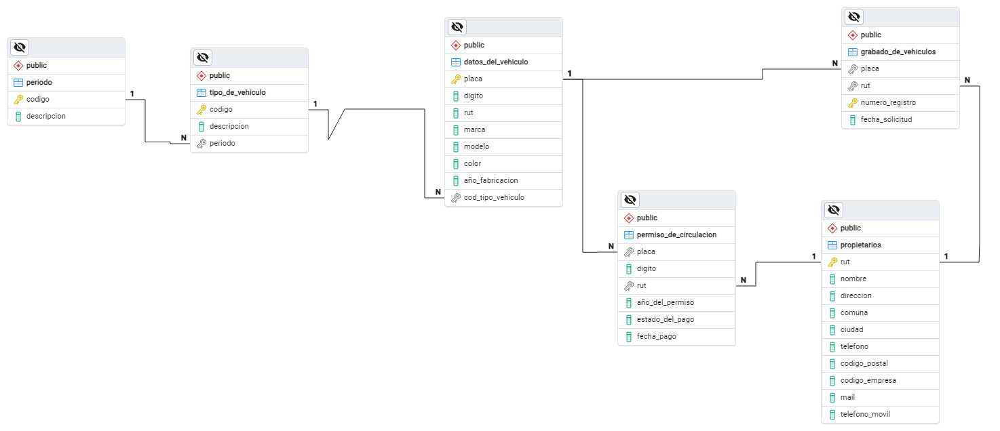
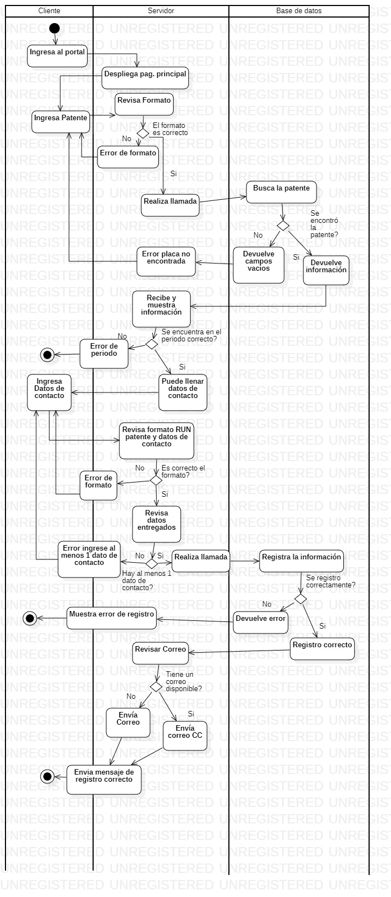

# Módulo Web de Solicitud de Grabado de Patentes Vehiculares

Este módulo web fue diseñado, modelado y desarrollado como proyecto de práctica profesional para la **Ilustre Municipalidad de Monte Patria (2024)**. El objetivo principal de la aplicación fue digitalizar el flujo de atención presencial, permitiendo a los usuarios realizar la solicitud de grabado de patentes vehiculares en línea de forma remota, segura y centralizada.

El proyecto destaca por la aplicación de lógica estructurada en el backend mediante **PHP** para el procesamiento de formularios dinámicos y la validación de reglas de negocio municipales.

---

## Características Principales

* **Formulario de Registro Dinámico:** Interfaz limpia construida en HTML para la captura de datos críticos del propietario, datos de contacto y especificaciones técnicas del vehículo.
* **Procesamiento del Lado del Servidor:** Arquitectura basada en PHP para la recepción, filtrado y validación de las solicitudes antes de interactuar con el sistema de persistencia.
* **Validación de Integridad:** Control de datos del lado del servidor para asegurar que los formatos de patentes y datos de usuario cumplan con los estándares requeridos.

---

## Stack Tecnológico

* **Backend:** PHP
* **Frontend:** HTML5, Bootstrap 5
* **Modelado Técnico:** Diagramas de Procesos e Ingeniería Relacional

---

## Diseño, Arquitectura y Modelado de Datos

La solidez de este módulo web radica en su planificación arquitectónica. Aunque el entorno de producción final es gestionado por la infraestructura municipal, el diseño lógico y relacional está completamente documentado a través de los siguientes artefactos disponibles en la carpeta `/diagrams`:

### 1. Modelo de Datos (Diagrama Entidad-Relación)
Diseño del esquema relacional que define la estructura de las tablas, llaves primarias, llaves foráneas y restricciones de integridad necesarias para almacenar las solicitudes y la información vehicular sin redundancias.


### 2. Flujo de Procesos (Diagrama de Actividades)
Modelado UML que describe el ciclo de vida completo de una solicitud, detallando los caminos de validación que sigue el backend en PHP desde el envío del formulario por el ciudadano hasta la confirmación del trámite.


---

## Estructura del Repositorio

```text
├── src/                      # Código fuente de la aplicación web
├── diagrams/                 # Documentación técnica y de arquitectura
│   ├── ActivityDiagram1.jpg  # Mapeo del flujo del sistema
│   └── BaseDatos.png         # Plano relacional de la base de datos
└── README.md                 # Documentación principal del proyecto
